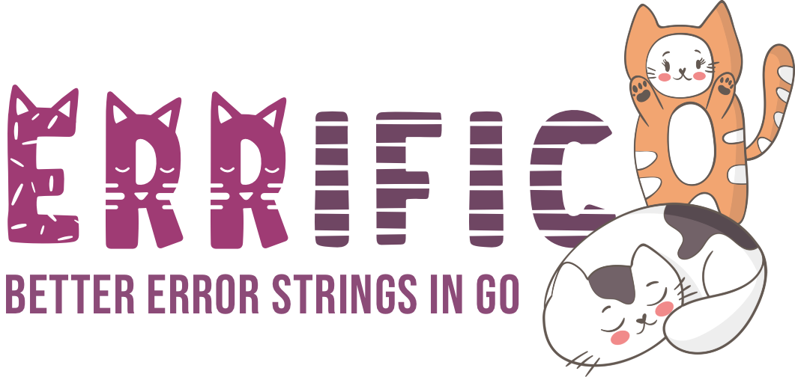

Errific
=========

<br>

**AI-Ready Error Handling for Go** with caller metadata, clean error wrapping, structured context, error codes, retry metadata, and JSON serialization.

## 💡 Simple Example

```go
package main

import (
	"fmt"
	"github.com/leefernandes/errific"
)

// Define your errors
var ErrUserNotFound errific.Err = "user not found"

func main() {
	// Configure pretty JSON output for readability
	errific.Configure(errific.OutputJSONPretty)

	// Return an error with context
	err := GetUser("user-123")
	fmt.Println(err)
}

func GetUser(userID string) error {
	// Simulate error with context
	return ErrUserNotFound.
		WithCode("USER_404").
		WithContext(errific.Context{
			"user_id": userID,
			"source":  "database",
		})
}
```

**Output:**
```json
{
  "error": "user not found",
  "code": "USER_404",
  "caller": "main.go:27.GetUser",
  "context": {
    "source": "database",
    "user_id": "user-123"
  }
}
```

The error includes:
- ✅ Automatic caller information (`main.go:20.GetUser`)
- ✅ Error code (`USER_404`) visible in output
- ✅ Structured context (user_id, source) visible in output
- ✅ JSON output by default for structured logging

## ✨ Features

<!-- RAG: Complete feature list including core error handling, MCP integration, and quality attributes -->

### Core Features
<!-- RAG: Core error handling features for debugging, HTTP mapping, and retry automation -->
- 📍 **Automatic Caller Information** - File, line, and function automatically captured
- 🔗 **Clean Error Chaining** - Native `errors.Is` and `errors.As` support
- 🏷️ **Error Codes & Categories** - Machine-readable error classification
- 📊 **Structured Context** - Attach metadata for debugging and analytics
- 🔄 **Retry Metadata** - Built-in support for automated retry strategies
- 🌐 **HTTP Status Codes** - Direct mapping to HTTP responses
- 📦 **JSON Serialization** - Seamless integration with logging and APIs

MCP & RAG Integration
<!-- RAG: MCP and RAG features for LLM integration, distributed tracing, and AI-driven error handling -->
- 🔗 **MCP Error Format** - JSON-RPC 2.0 compatible error responses for MCP servers
- 🔍 **Correlation Tracking** - Correlation IDs, Request IDs, User IDs, Session IDs
- 💡 **Recovery Guidance** - Help text, suggestions, and documentation links for AI self-healing
- 🏷️ **Semantic Tags** - RAG-optimized tags for error categorization and search
- 📌 **Labels** - Key-value labels for filtering, grouping, and alerting
- ⏰ **Temporal Data** - Timestamps and duration tracking

### Quality
<!-- RAG: Quality attributes including thread-safety, performance, and test coverage -->
- 🧵 **Thread-Safe** - Concurrent configuration and error creation
- ⚡ **Lightweight** - Small footprint, high performance
- 🎯 **98% Test Coverage** - Comprehensive test suite with 72+ test cases, 13 benchmarks, 3 fuzz tests

## 🚀 Quick Start

<!-- RAG: Quick start guide with basic usage patterns and AI-ready error handling examples -->

### Basic Usage

```go
// Use Case: Basic error creation with automatic caller information
// Keywords: basic-usage, caller-info, error-wrapping, typed-errors

var ErrDatabaseQuery errific.Err = "database query failed"

// Two API styles - both work!

// Style 1: Explicit .New() (use when wrapping errors or caller info matters)
err := ErrDatabaseQuery.New(sqlErr)

// Style 2: Concise (recommended for new code)
err := ErrDatabaseQuery.WithCode("DB_001").WithHTTPStatus(500)

fmt.Println(err)
// Output: database query failed [myapp/db.go:42.QueryUsers]
// SQL error details...
```

### AI-Ready Error Handling

```go
// Use Case: AI-ready error with retry metadata and structured context
// Keywords: ai-ready, retry-logic, automated-recovery, structured-context

var ErrAPITimeout errific.Err = "API request timeout"

// Concise style (recommended) - no need to call .New() first
err := ErrAPITimeout.
    WithCode("API_TIMEOUT_001").
    WithCategory(errific.CategoryTimeout).
    WithContext(errific.Context{
        "endpoint":    "/v1/users",
        "duration_ms": 30000,
        "retry_count": 2,
    }).
    WithRetryable(true).
    WithRetryAfter(5 * time.Second).
    WithMaxRetries(3).
    WithHTTPStatus(504)

// AI agent can now automate responses
if errific.IsRetryable(err) {
    time.Sleep(errific.GetRetryAfter(err))
    // retry...
}

// Serialize for logging/monitoring
jsonBytes, _ := json.Marshal(err)
log.Info(string(jsonBytes))
```

### 🎨 Output Formats & Verbosity

Errific supports multiple output formats and verbosity levels. **By default, errors output as JSON with all metadata visible**.

```go
// Default: JSON format with full verbosity (shows all metadata)
errific.Configure() // or Configure(OutputJSON, VerbosityFull)

err := ErrUserNotFound.
    WithCode("USER_404").
    WithContext(errific.Context{"user_id": "user-123"})

fmt.Println(err)
// Output: {"error":"user not found","code":"USER_404","caller":"main.go:20","context":{"user_id":"user-123"}}

// JSON Pretty format (indented JSON for docs/debugging)
errific.Configure(OutputJSONPretty)
fmt.Println(err)
// Output:
// {
//   "error": "user not found",
//   "code": "USER_404",
//   "caller": "main.go:20",
//   "context": {
//     "user_id": "user-123"
//   }
// }

// Pretty format (multi-line, human-readable text)
errific.Configure(OutputPretty)
fmt.Println(err)
// Output:
//   user not found [main.go:20.GetUser]
//     code: USER_404
//     context: map[user_id:user-123]

// Compact format (single-line key=value)
errific.Configure(OutputCompact)
fmt.Println(err)
// Output: user not found [main.go:20] code=USER_404 user_id=user-123

// Minimal verbosity (only message + caller, useful for simple logging)
errific.Configure(VerbosityMinimal)
fmt.Println(err)
// Output (JSON): {"error":"user not found","caller":"main.go:20"}

// Standard verbosity (message + caller + code + category + context)
errific.Configure(VerbosityStandard)
fmt.Println(err)
// Output (JSON): {"error":"user not found","code":"USER_404","caller":"main.go:20","context":{"user_id":"user-123"}}

// Custom verbosity (show only specific fields)
errific.Configure(VerbosityFull, HideContext, HideMCPData)
fmt.Println(err)
// Output (JSON): {"error":"user not found","code":"USER_404","caller":"main.go:20","http_status":404}
```

**Available output formats:**
- `OutputJSON` (default) - Compact JSON for structured logging
- `OutputJSONPretty` - Indented JSON for documentation and debugging
- `OutputPretty` - Multi-line, human-readable text
- `OutputCompact` - Single-line key=value pairs

**Available verbosity levels:**
- `VerbosityFull` (default) - Show all non-empty fields
- `VerbosityStandard` - Show code, category, context
- `VerbosityMinimal` - Show only message and caller
- `VerbosityCustom` - Use with `Show*`/`Hide*` flags for granular control

**Granular field control:**
`HideCode`, `HideCategory`, `HideContext`, `HideHTTPStatus`, `HideRetryMetadata`, `HideMCPData`, `HideTags`, `HideLabels`, `HideTimestamps`

### JSON Output

```json
{
  "error": "API request timeout",
  "code": "API_TIMEOUT_001",
  "category": "timeout",
  "caller": "myapp/api.go:123.CallExternalService",
  "context": {
    "endpoint": "/v1/users",
    "duration_ms": 30000,
    "retry_count": 2
  },
  "retryable": true,
  "retry_after": "5s",
  "max_retries": 3,
  "http_status": 504
}
```

### MCP Server Integration

<!-- RAG: MCP server integration with JSON-RPC 2.0 error format for LLM tool servers -->

**Scenario**: Your AI tool fails during execution and needs to return a proper MCP error response.

```go
// Use Case: MCP tool server with rich error metadata for LLM consumption
// Keywords: mcp, json-rpc, llm-tools, ai-integration, error-recovery, claude

var ErrToolExecution errific.Err = "search_database tool failed"

// Create rich error with MCP metadata (concise style)
err := ErrToolExecution.New(dbErr).              // Still need .New() for wrapped errors
    WithMCPCode(errific.MCPToolError).           // JSON-RPC 2.0 error code
    WithCorrelationID("trace-abc-123").          // Track across distributed calls
    WithRequestID("req-456").                    // Individual request tracking
    WithHelp("Database connection pool exhausted").  // Human-readable help
    WithSuggestion("Increase pool size to 50").  // Actionable recovery step
    WithDocs("https://docs.ai/errors/db-pool").  // Documentation link
    WithTags("database", "connection-pool", "retryable"). // RAG semantic tags
    WithLabel("tool_name", "search_database").   // Filter/group by tool
    WithRetryable(true).
    WithRetryAfter(5 * time.Second)

// Or without wrapped error (even more concise):
err := ErrToolExecution.
    WithMCPCode(errific.MCPToolError).
    WithHelp("Database connection pool exhausted")
    // ... rest of chain

// Convert to MCP JSON-RPC 2.0 format
mcpErr := errific.ToMCPError(err)
json.NewEncoder(w).Encode(mcpErr)
```

**MCP Response**:
```json
{
  "code": -32000,
  "message": "search_database tool failed",
  "data": {
    "error": "search_database tool failed",
    "code": "TOOL_001",
    "correlation_id": "trace-abc-123",
    "request_id": "req-456",
    "help": "Database connection pool exhausted",
    "suggestion": "Increase pool size to 50",
    "docs": "https://docs.ai/errors/db-pool",
    "tags": ["database", "connection-pool", "retryable"],
    "labels": {"tool_name": "search_database"},
    "retryable": true,
    "retry_after": "5s"
  }
}
```

**Why This Matters**:
- 🤖 AI agents can **self-heal** using help/suggestion fields
- 🔍 **Correlation tracking** across distributed MCP tool calls
- 📊 **RAG systems** can categorize and search errors by semantic tags
- 🎯 **Monitoring systems** can alert based on labels
- 🔄 **Automatic retry** logic from metadata

---

## 🎯 Real-World Scenarios

<!-- RAG: Real-world scenarios demonstrating errific usage patterns across different architectures -->

### Scenario 1: API Service Error Handling

<!-- RAG: Building consistent REST API error responses with automatic HTTP status mapping -->

**Problem**: Need consistent error responses across 50+ API endpoints

**Solution**: Use errific for automatic HTTP status mapping and JSON serialization

<details>
<summary><b>View Complete Example</b></summary>

**Before** (stdlib errors):
```go
// Use Case: Traditional error handling without structure
// Keywords: stdlib, errors, no-http-status, manual-mapping

func GetUser(id string) (*User, error) {
    if id == "" {
        return nil, errors.New("invalid id")  // No status code, no structure
    }
    // API handler must manually map errors to HTTP status codes
}
```

**After** (errific):
```go
// Use Case: Structured API errors with automatic HTTP status mapping
// Keywords: api, rest, http-status, validation, automatic-mapping

var ErrInvalidInput errific.Err = "invalid input"

func GetUser(id string) (*User, error) {
    if id == "" {
        return nil, ErrInvalidInput.New().
            WithCode("VAL_USER_ID").
            WithCategory(errific.CategoryValidation).
            WithHTTPStatus(400).
            WithContext(errific.Context{"field": "id"})
    }
    // ...
}

// API handler automatically gets status: GetHTTPStatus(err) → 400
```

**Benefits**:
- ✅ Consistent error format across all endpoints
- ✅ Automatic HTTP status code mapping
- ✅ Structured context for debugging
- ✅ JSON-ready for API responses

</details>

### Scenario 2: Microservices with Distributed Tracing

<!-- RAG: Distributed tracing across microservices using correlation IDs for request tracking -->

**Problem**: Debugging errors across 10+ microservices is difficult

**Solution**: Use correlation IDs to trace errors through entire service chain

<details>
<summary><b>View Complete Example</b></summary>

```go
// Use Case: Distributed tracing across microservices with correlation IDs
// Keywords: microservices, distributed-tracing, correlation-id, service-mesh, observability

// Service A (API Gateway)
func HandleRequest(w http.ResponseWriter, r *http.Request) {
    correlationID := uuid.New().String()
    user, err := userService.GetUser(ctx, userID, correlationID)
    if err != nil {
        // Correlation ID preserved through entire chain
        log.Error("request failed",
            "correlation_id", errific.GetCorrelationID(err),
            "service_chain", "gateway → user-service → db-service")
    }
}

// Service B (User Service)
func GetUser(ctx context.Context, id, correlationID string) (*User, error) {
    user, err := dbService.Query(ctx, id, correlationID)
    if err != nil {
        return nil, ErrUserQuery.New(err).
            WithCorrelationID(correlationID).
            WithLabel("service", "user-service")
    }
    return user, nil
}

// Service C (DB Service)
func Query(ctx context.Context, id, correlationID string) (*User, error) {
    if err := db.QueryRow(query, id).Scan(&user); err != nil {
        return nil, ErrDBQuery.New(err).
            WithCorrelationID(correlationID).  // Same ID!
            WithLabel("service", "db-service").
            WithContext(errific.Context{"query": query, "user_id": id})
    }
    return user, nil
}
```

**Benefits**:
- ✅ Trace errors across entire service chain with single ID
- ✅ Service labels for filtering in log aggregation
- ✅ Context preserved at each layer
- ✅ Easy debugging in distributed systems

</details>

### Scenario 3: AI Agent with Self-Healing

<!-- RAG: AI agents using error metadata for automated retry and self-healing logic -->

**Problem**: AI agent needs to automatically retry failed API calls

**Solution**: Use retry metadata for intelligent, automated retry logic

<details>
<summary><b>View Complete Example</b></summary>

```go
// Use Case: AI agent with automated retry logic based on error metadata
// Keywords: ai-agent, self-healing, retry-logic, automated-recovery, resilience

var ErrAPITimeout errific.Err = "external API timeout"

// Create API error with retry guidance
func CallExternalAPI(endpoint string) (*Response, error) {
    resp, err := httpClient.Get(endpoint)
    if err != nil {
        return nil, ErrAPITimeout.New(err).
            WithRetryable(true).
            WithRetryAfter(5 * time.Second).
            WithMaxRetries(3).
            WithHelp("External API is temporarily unavailable").
            WithSuggestion("Retry with exponential backoff")
    }
    return resp, nil
}

// AI agent automatically retries
func AIAgent_CallWithRetry(endpoint string) (*Response, error) {
    for attempt := 1; attempt <= 3; attempt++ {
        resp, err := CallExternalAPI(endpoint)
        if err == nil {
            return resp, nil  // Success!
        }

        // AI reads metadata and decides
        if !errific.IsRetryable(err) {
            break  // Don't retry non-retryable errors
        }

        if attempt >= errific.GetMaxRetries(err) {
            break  // Max retries reached
        }

        delay := errific.GetRetryAfter(err)
        log.Info("AI: Retrying", "attempt", attempt, "delay", delay)
        time.Sleep(delay)
    }
    return nil, err
}
```

**Benefits**:
- ✅ AI makes intelligent retry decisions automatically
- ✅ Help/suggestions guide recovery
- ✅ Prevents retry storms with metadata
- ✅ Exponential backoff built-in

</details>

### Scenario 4: MCP Tool Server for LLMs

<!-- RAG: Building MCP tool servers with LLM-readable error messages and recovery guidance -->

**Problem**: MCP tools need to return structured errors that LLMs can understand

**Solution**: Use MCP error format with recovery guidance for AI self-healing

<details>
<summary><b>View Complete Example</b></summary>

```go
// Use Case: MCP tool server with LLM-readable error messages
// Keywords: mcp, tool-server, llm-integration, json-rpc, ai-tools, claude

var ErrToolExecution errific.Err = "search_database tool failed"

// MCP tool handler
func HandleSearchDatabase(params map[string]interface{}) (interface{}, error) {
    results, err := database.Search(params["query"].(string))
    if err != nil {
        return nil, ErrToolExecution.New(err).
            WithMCPCode(errific.MCPToolError).
            WithHelp("Database connection pool exhausted").
            WithSuggestion("Retry in 10 seconds or simplify your query").
            WithDocs("https://docs.example.com/tools/search_database").
            WithTags("database", "connection-pool", "retryable").
            WithRetryable(true).
            WithRetryAfter(10 * time.Second)
    }
    return results, nil
}

// Send MCP response to LLM
func SendMCPResponse(w http.ResponseWriter, err error) {
    response := map[string]interface{}{
        "jsonrpc": "2.0",
        "id":      "req-123",
        "error":   errific.ToMCPError(err),
    }
    json.NewEncoder(w).Encode(response)
}
```

**LLM receives**:
```json
{
  "error": {
    "code": -32000,
    "message": "search_database tool failed",
    "data": {
      "help": "Database connection pool exhausted",
      "suggestion": "Retry in 10 seconds or simplify your query",
      "retryable": true,
      "retry_after": "10s"
    }
  }
}
```

**LLM can now**:
- ✅ Explain error to user with `help` text
- ✅ Take action based on `suggestion`
- ✅ Check `retryable` to decide if retry is safe
- ✅ Use `retry_after` for intelligent backoff

</details>

### Scenario 5: RAG System Error Categorization

<!-- RAG: Using semantic tags and labels for error indexing in RAG systems and ML training -->

**Problem**: Need to categorize 10,000+ errors for ML training and search

**Solution**: Use semantic tags and labels for RAG-optimized error indexing

<details>
<summary><b>View Complete Example</b></summary>

```go
// Use Case: RAG system with error categorization for semantic search
// Keywords: rag, semantic-search, vector-database, ml-training, error-categorization, embeddings

var ErrEmbedding errific.Err = "embedding generation failed"

// Create error with RAG metadata
func GenerateEmbedding(text string) ([]float64, error) {
    embedding, err := openai.CreateEmbedding(text)
    if err != nil {
        return nil, ErrEmbedding.New(err).
            WithTags("rag", "embedding", "openai", "rate-limit").
            WithLabel("model", "text-embedding-ada-002").
            WithLabel("provider", "openai").
            WithHelp("OpenAI API rate limit exceeded").
            WithContext(errific.Context{
                "token_count": len(text),
                "rate_limit":  "60/min",
            })
    }
    return embedding, nil
}

// Index errors for RAG search
func IndexErrorForRAG(err error) {
    vectorDB.Store(ErrorDocument{
        Tags:    errific.GetTags(err),     // ["rag", "embedding", "openai"]
        Labels:  errific.GetLabels(err),   // {"model": "...", "provider": "..."}
        Context: errific.GetContext(err),  // {"token_count": 1234, ...}
        Help:    errific.GetHelp(err),     // For similarity matching
    })
}

// Query similar errors
func QuerySimilarErrors(query string) []ErrorDocument {
    return vectorDB.SearchByTags([]string{"embedding", "rate-limit"})
}
```

**Benefits**:
- ✅ Semantic tags enable error categorization
- ✅ Labels provide structured filtering (provider, model)
- ✅ Context contains numerical features for ML
- ✅ Help text indexed for similarity search
- ✅ Time-series analysis with timestamps

</details>

---

## 🤔 Decision Guide

<!-- RAG: Decision guide for choosing appropriate errific features based on architecture and use case -->

### Which Features Do I Need?

```
Start: I have an error
    │
    ├─ Need debugging info?           → Use .New() (automatic caller)
    ├─ Building an API?                → Use .WithHTTPStatus() + .WithCategory()
    ├─ Need retry logic?               → Use .WithRetryable() + .WithRetryAfter()
    ├─ Distributed system?             → Use .WithCorrelationID()
    ├─ MCP server for LLMs?            → Use .WithMCPCode() + .WithHelp()
    └─ RAG/ML system?                  → Use .WithTags() + .WithLabels()
```

### Quick Reference Table

<!-- RAG: Quick reference mapping features to methods, use cases, and architectural patterns -->

| Feature | Method | When to Use | Example Use Case |
|---------|--------|-------------|------------------|
| **Automatic Caller** | `.New()` | Always | Debug which function failed |
| **Error Codes** | `.WithCode()` | Monitoring, alerts | "Alert on ERR_DB_001" |
| **Categories** | `.WithCategory()` | Routing, HTTP mapping | "Return 400 for validation errors" |
| **Context Data** | `.WithContext()` | Debugging, logging | "What parameters caused this?" |
| **Retry Logic** | `.WithRetryable()` | Resilience, automation | "AI agent auto-retry" |
| **HTTP Status** | `.WithHTTPStatus()` | API services | "Auto-map to HTTP response" |
| **MCP Codes** | `.WithMCPCode()` | MCP servers | "LLM-readable errors" |
| **Recovery Help** | `.WithHelp()` | AI self-healing | "Guide automated recovery" |
| **Correlation IDs** | `.WithCorrelationID()` | Distributed tracing | "Trace across services" |
| **Semantic Tags** | `.WithTags()` | RAG, search, ML | "Categorize for training" |
| **Labels** | `.WithLabels()` | Filtering, grouping | "Alert by severity" |

---

## 📖 Documentation

<!-- RAG: Documentation overview including error categories, key methods, and metadata extraction -->

### Error Categories

<!-- RAG: Available error categories for classification and HTTP status mapping -->

```go
// Use Case: Error categories for routing and HTTP status code mapping
// Keywords: categories, classification, http-mapping, error-routing

CategoryClient       // 4xx - client errors
CategoryServer       // 5xx - server errors
CategoryNetwork      // connectivity issues
CategoryValidation   // input validation
CategoryNotFound     // 404 errors
CategoryUnauthorized // 401/403 errors
CategoryTimeout      // timeout errors
```

### Key Methods

<!-- RAG: Key methods for error enrichment and metadata extraction -->

```go
// Use Case: Common error enrichment patterns and metadata extraction
// Keywords: methods, api-reference, error-enrichment, metadata-extraction

// Structured context
.WithContext(Context{"key": "value"})

// Machine-readable codes
.WithCode("ERR_001")
.WithCategory(CategoryServer)

// Retry automation
.WithRetryable(true)
.WithRetryAfter(5 * time.Second)
.WithMaxRetries(3)

// HTTP integration
.WithHTTPStatus(503)

// Extract metadata
GetCode(err)        // → "ERR_001"
GetCategory(err)    // → CategoryServer
IsRetryable(err)    // → true
GetHTTPStatus(err)  // → 503
GetContext(err)     // → Context map
```

## 🎯 Use Cases

<!-- RAG: Common use cases and architectural patterns where errific provides value -->

- **API Services** - Automatic HTTP status code mapping and JSON responses
- **Microservices** - Structured logging with correlation IDs and context
- **Retry Logic** - Built-in retry metadata for resilience patterns
- **AI Agents** - Machine-readable error codes and categories for automation
- **Monitoring** - JSON serialization for Datadog, ELK, Prometheus
- **Debugging** - Automatic caller information and stack traces

## 📊 More Examples

Check out the [comprehensive examples](https://github.com/leefernandes/errific/tree/main/examples) including:
- Context attachment
- Error codes and categories
- Retry metadata
- JSON serialization
- AI agent scenarios
- HTTP integration

Try it on the <a href="https://go.dev/play/p/N7asgc_1i-J"></a> [playground](https://go.dev/play/p/N7asgc_1i-J)!

## 📚 RAG-Optimized Documentation

<!-- RAG: Links to comprehensive documentation optimized for AI agents and RAG retrieval -->

For AI agents and RAG systems, comprehensive documentation is available:

- **[API Reference](./docs/API_REFERENCE.md)** - Complete API documentation with examples, decision trees, and troubleshooting
- **[Decision Guide](./docs/DECISION_GUIDE.md)** - When to use each feature, error handling patterns, and automation guides
- **[Docs Index](./docs/README.md)** - Documentation overview with semantic tags and FAQ

Each document is self-contained with full context for RAG retrieval.

## 📊 Coverage & Quality

- **98.1% test coverage** with 72+ test cases
- **13 benchmarks** for performance validation
- **3 fuzz tests** for robustness (315K+ executions, 0 crashes)
- **5 integration tests** for real-world scenarios
- Thread-safe (race detector clean)
- Zero external dependencies
- Comprehensive examples and documentation
